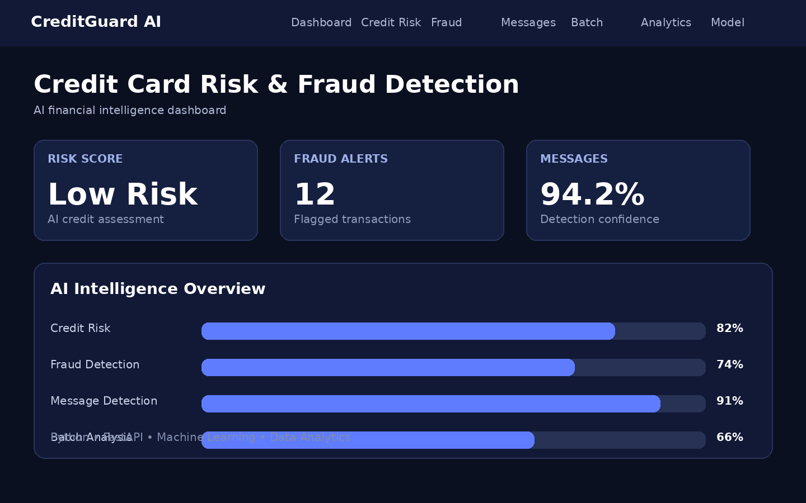
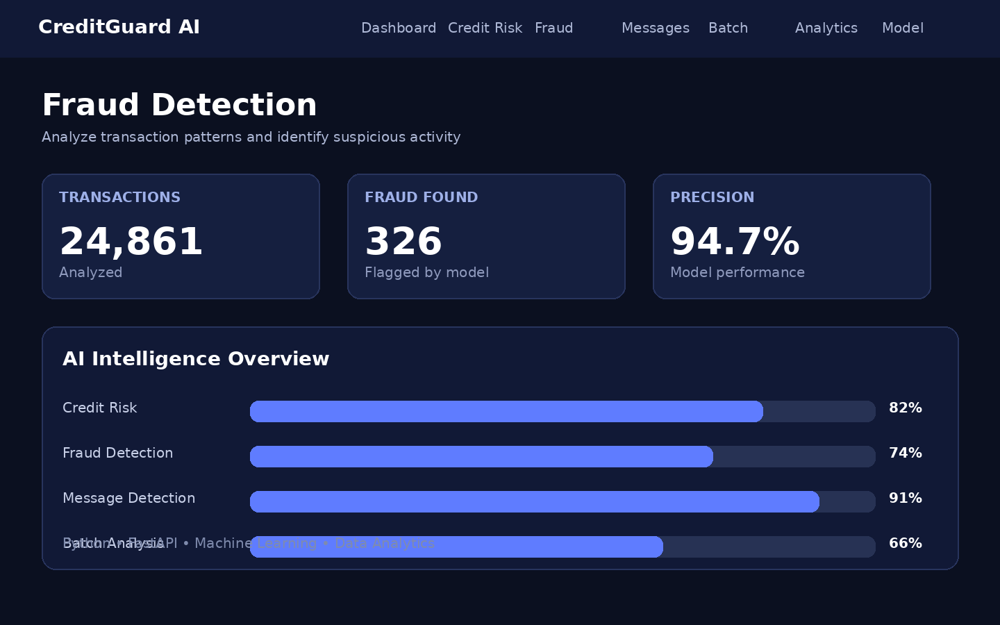
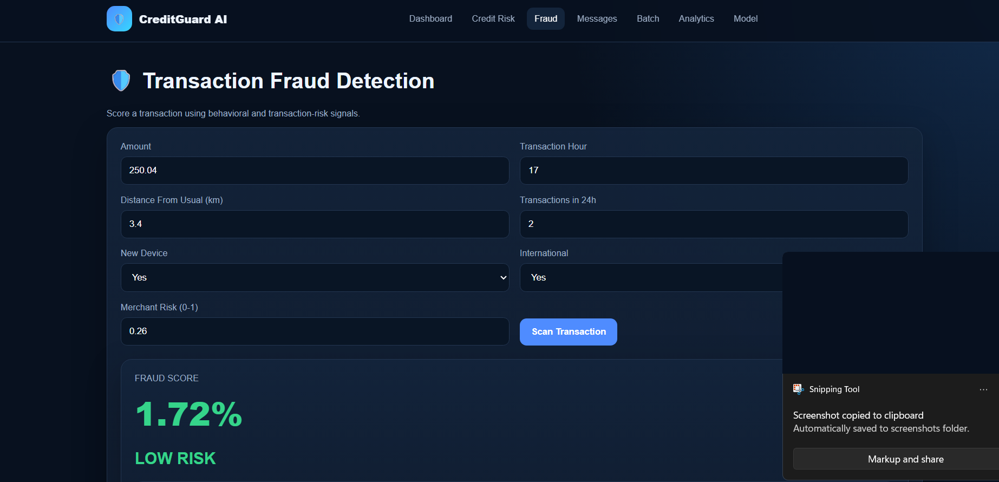

# AI Credit Card Risk & Fraud Detection

A complete local AI/ML financial risk analysis platform built with Python, Machine Learning, SQL, FastAPI, HTML, CSS, and JavaScript.

The system provides credit-card default risk prediction, transaction fraud scoring, financial-message classification, batch prediction, analytics, and model performance monitoring through a local web application.

> Educational / Demo Project: This system is designed for learning and demonstration purposes. It should not be used as the sole basis for real lending, credit, fraud, or financial decisions.

---

## Features

### Credit Risk Prediction

* Credit-card default risk prediction
* Risk score generation
* Customer financial profile analysis
* Credit utilization analysis
* Payment history analysis
* Previous default analysis

### Fraud Detection

* Transaction fraud scoring
* Suspicious transaction identification
* Fraud probability prediction
* Risk classification

### Financial Message Classification

Classifies bank and credit-card style:

* SMS messages
* Email-style messages
* Suspicious financial messages
* Normal financial messages

### Batch Prediction

Supports bulk prediction using:

* CSV
* XLSX

Example columns:

```text
age
income
credit_score
employment_years
debt
credit_limit
previous_defaults
utilization
payment_history
```

### Analytics Dashboard

* Prediction statistics
* Fraud analysis
* Credit-risk distribution
* Model performance
* Transaction insights

### FastAPI REST API

Available endpoints:

```text
GET  /api/health
POST /api/predict-credit
POST /api/detect-fraud
POST /api/detect-message
POST /api/batch-predict
GET  /api/model-metrics
```

---

## System Design

The application follows a modular architecture:

```text
Frontend
    |
    v
FastAPI Backend
    |
    v
ML Services
    |
    v
Machine Learning Models
    |
    v
Prediction and Analytics
```

### High-Level Architecture

```text
                         USER
                           |
                           v
                HTML / CSS / JavaScript
                           |
                           v
                    FastAPI Backend
                           |
            +--------------+--------------+
            |              |              |
            v              v              v
       Credit Risk      Fraud         Message
         Service       Detection    Classification
            |              |              |
            +--------------+--------------+
                           |
                           v
                    ML Model Layer
                           |
              +------------+------------+
              |            |            |
              v            v            v
        Scikit-learn   XGBoost    Local Models
              |            |            |
              +------------+------------+
                           |
                           v
                    Prediction Result
                           |
             +-------------+-------------+
             |             |             |
             v             v             v
        Dashboard      Analytics    Batch Results
```

---

## Prediction Workflow

### Credit Risk

```text
User Input
    |
    v
FastAPI
    |
    v
Input Validation
    |
    v
Data Preprocessing
    |
    v
Feature Engineering
    |
    v
Machine Learning Model
    |
    v
Risk Score
    |
    v
Dashboard
```

### Fraud Detection

```text
Transaction
    |
    v
Feature Validation
    |
    v
Preprocessing
    |
    v
Fraud Detection Model
    |
    v
Fraud Probability
    |
    v
Risk Classification
```

### Batch Prediction

```text
CSV / XLSX
    |
    v
File Upload
    |
    v
Validation
    |
    v
Preprocessing
    |
    v
Machine Learning Model
    |
    v
Batch Predictions
    |
    v
Analytics
```

---

## Machine Learning

The project demonstrates:

* Classification
* Fraud detection
* Credit-risk prediction
* Feature engineering
* Data preprocessing
* Imbalanced-data handling
* Model evaluation
* Precision
* Recall
* F1-Score
* Model comparison
* Feature importance

---

## Tech Stack

### Programming

* Python 3.11.9

### Machine Learning

* Scikit-learn
* XGBoost
* Pandas
* NumPy

### Backend

* FastAPI
* Uvicorn
* REST API

### Frontend

* HTML
* CSS
* JavaScript

### Data

* CSV
* XLSX
* SQL

### Visualization

* Dashboard
* Analytics
* Model metrics

---

## Project Structure

```text
AI-Credit-Card-Risk-Fraud/
|
+-- backend/
|   +-- main.py
|   +-- routes/
|   +-- services/
|   +-- models/
|
+-- frontend/
|   +-- index.html
|   +-- css/
|   +-- js/
|
+-- data/
|
+-- models/
|
+-- notebooks/
|
+-- screenshots/
|
+-- demo/
|   +-- video.mp4
|
+-- static/
|
+-- app.py
+-- requirements.txt
+-- README.md
```

---

## Python Setup

Recommended Python version:

```text
Python 3.11.9
```

Create a virtual environment:

```bash
python -m venv venv
```

### Windows

```bash
venv\Scripts\activate
```

### macOS / Linux

```bash
source venv/bin/activate
```

Upgrade pip:

```bash
python -m pip install --upgrade pip
```

Install dependencies:

```bash
pip install -r requirements.txt
```

---

## Run the Application

Start the FastAPI server:

```bash
python -m uvicorn backend.main:app --reload
```

Open the application:

```text
http://127.0.0.1:8000
```

---

## API

### Health Check

```http
GET /api/health
```

Checks whether the API is running.

### Credit Risk Prediction

```http
POST /api/predict-credit
```

Predicts credit/default risk from customer financial information.

### Fraud Detection

```http
POST /api/detect-fraud
```

Analyzes a transaction and returns fraud/risk information.

### Message Detection

```http
POST /api/detect-message
```

Classifies bank or credit-card SMS and email-style messages.

### Batch Prediction

```http
POST /api/batch-predict
```

Processes multiple credit records from CSV/XLSX files.

### Model Metrics

```http
GET /api/model-metrics
```

Returns model performance information.

---

## Screenshots

### Dashboard



### Fraud Detection



### Credit Risk Prediction


### Transaction Analysis



---

## Demo

Project demonstration video:

```text
demo/video.mp4
demo\demo video.mp4


## Batch CSV Format

The batch prediction file should contain:

```text
age
income
credit_score
employment_years
debt
credit_limit
previous_defaults
utilization
payment_history
```

Example:

```csv
age,income,credit_score,employment_years,debt,credit_limit,previous_defaults,utilization,payment_history
35,65000,720,8,12000,30000,0,0.40,good
42,48000,610,5,22000,25000,1,0.75,poor
29,85000,760,6,8000,40000,0,0.25,good
```

---

## Model Training

On the first server start, the application can automatically create deterministic demo datasets and train local models when model files are not available.

This makes the project easy to run locally without requiring an external ML service.

---

## Future Improvements

* Real-time fraud detection
* Advanced anomaly detection
* Deep Learning models
* Real-time transaction monitoring
* Docker deployment
* Kubernetes deployment
* Cloud deployment
* PostgreSQL integration
* Redis caching
* Authentication and authorization
* Model monitoring
* SHAP-based explainability
* Automated model retraining
* Production-grade logging

---

## Security and Responsible AI

This project is intended for educational purposes.

It does not provide financial advice and should not be used as the sole decision-maker for:

* Lending
* Credit approval
* Fraud investigation
* Financial risk decisions

A production system would require proper security, privacy protection, compliance, monitoring, human review, and model validation.

---

## Project Goal

The goal of this project is to demonstrate a practical end-to-end Machine Learning application combining:

```text
Python
    +
Machine Learning
    +
SQL
    +
FastAPI
    +
Frontend
    +
Analytics
```

The project demonstrates how Machine Learning models can be integrated into a usable web application rather than being limited to a notebook.

---

## Author

Built as a practical AI/ML project to explore:

* Credit Risk
* Fraud Detection
* Machine Learning
* Python
* SQL
* FastAPI
* Data Analytics

---

## Disclaimer

Educational/Demo Project Only.

The predictions generated by this application are demonstrations of machine-learning workflows and should not be treated as professional financial, lending, credit, or fraud-detection decisions.
